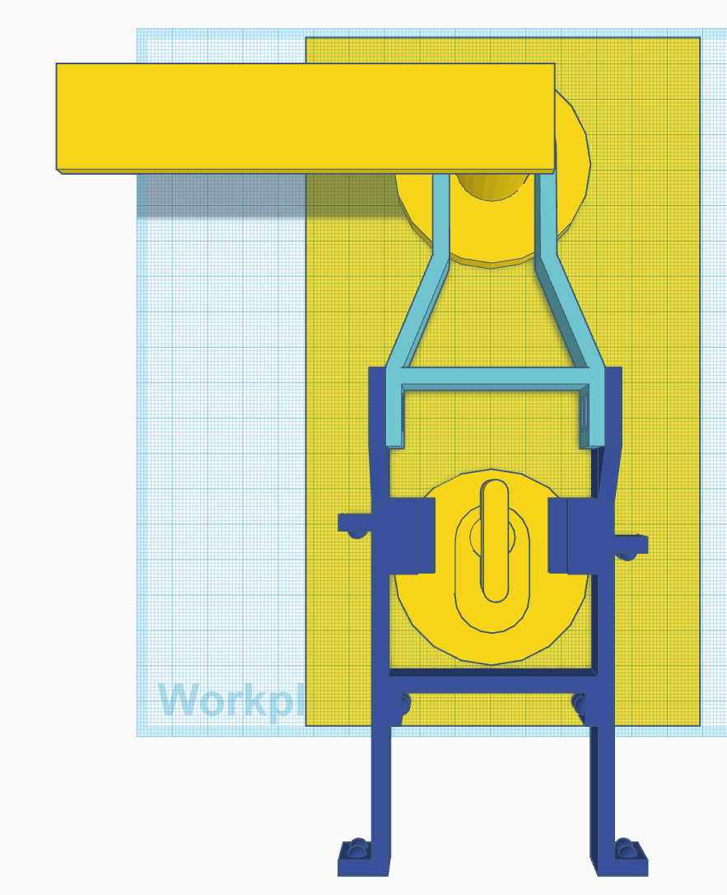
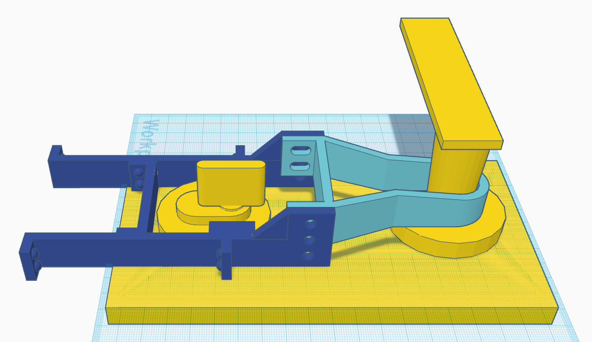
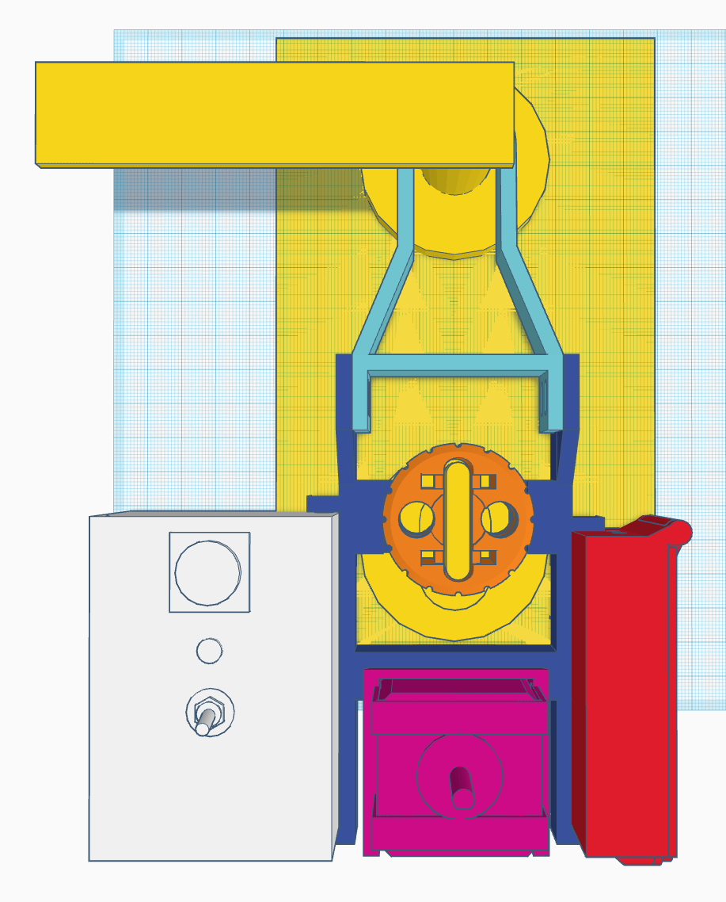
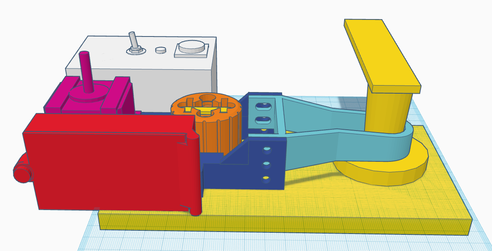
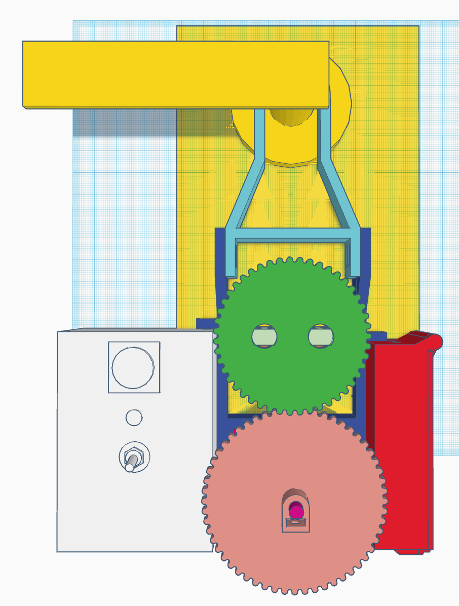
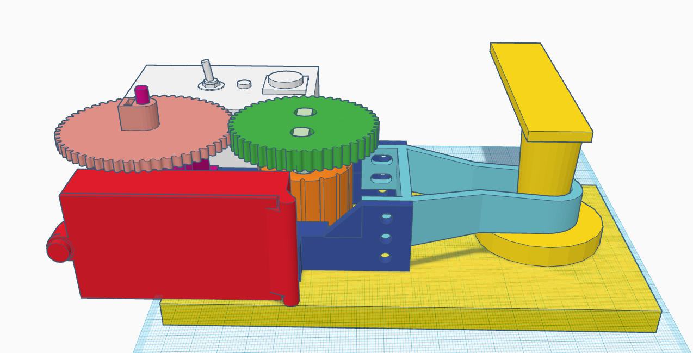

# Dumb door

Like a smart door, but dumb. Does not require invasive installation, related to [Embedded systems project](https://github.com/gardehal/embedded-systems/blob/master/projects/dumb-door/dumb-door.md) project.

## Assembly

- frame-upper (light blue)
- frame-lower (dark blue), note the "ears" aligned with the lock

- lock-adapter (orange)
- brain-case (white), including brain-lid, button, LED, on/off switch
- motor-case (hot pink), including motor and 2 motor-case-clips
- battery-case (red), including battery-lid

- lock-gear (dark green)
- lock-gear-pins (light green)
- motor-gear (light pink)
