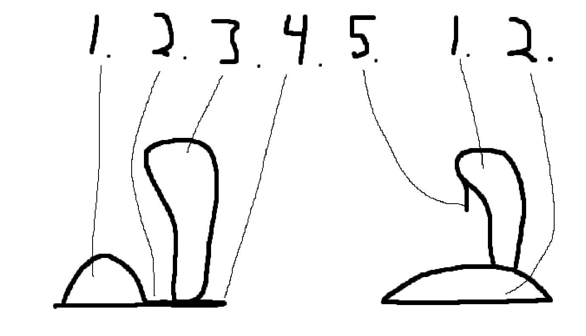
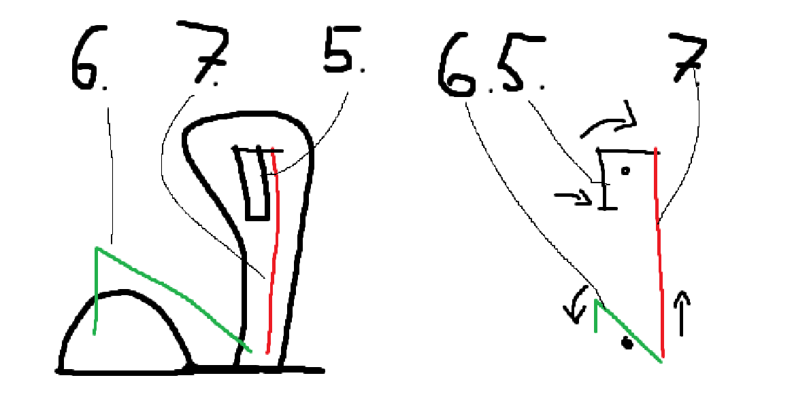

# Ergonomic mouse joystick

3D printed add-on to make mice a little more comfortable to use without buying a new product.

Using F-16 Sidestick Grip by JFlyer81 on Thingiverse: https://www.thingiverse.com/thing:4544115
Using Logitech G502 Pinkie rest by tarifacarlos on Thingiverse: https://www.thingiverse.com/thing:4834530

Example of similar style: https://www.3m.com/3M/en_US/p/d/cbgbjw011267/

## Assembly

Option 1, use default joystick placement (Logitech G502):
- Download and print all files in /stl
- On the connector Insert a piece of magnetic metal (not a magnet) in the circle by the thumb rest
- Attach the connector to the mouse 
- Slide the hand rest over the node
- Use two M3 or M4 screws to assemble the joystick from the left and the right side shells
- Slide the joystick over the node
- Insert pin
- Tie a string to the lever
- Insert the lever in the joystick, on the left side
- Insert trigger into joystick and tie the string to it, so tight that pushing the trigger lifts the lever
- Attach joystick top
- Attach joystick face

Option 2, set your own joystick placement (Logitech G502):
- Download and print all files in /stl EXCEPT connector and hand rest
- Download the [connector](./test/test-03-hand-rest-mouse-joystick.stl) and the [node](./test/test-05-node.stl) from /test
- On the connector Insert a piece of magnetic metal (not a magnet) in the circle by the thumb rest
- Attach the connector to the mouse
- Use two M3 or M4 screws to assemble the joystick from the left and the right side shells
- Attach the node to a spot of your choosing
  - Grab the joystick as normal, place it on the hand rest until you find a spot you like
  - Trace the inside and outside the joystick with a pen or marker
  - Glue the node to where you marked the inside of the joystick. If it was not possible, measure 6.5 mm from the FLAT left and right side of the outer trace of the joystick, 9 mm from the front and back 
- Slide the joystick over the node
- Insert pin
- Tie a string to the lever
- Insert the lever in the joystick, on the left side
- Insert trigger into joystick and tie the string to it, so tight that pushing the trigger lifts the lever
- Attach joystick top
- Attach joystick face

## Goals

- Create a removable conversion kit for Logitech G502 mouse
- Create a joystick which can use the mouse M1 and M2 buttons of host mouse
- More comfortable to use than the mouse in normal use

#### Later goals

- Integrated electronics rather than operating host mouse external buttons
- Add functions for scroll and back/forward buttons
- Joystick for arrow keys

## Sketches

1. Host mouse
2. Adapter
3. Joystick
4. Hand rest
5. Trigger (M1)
6. Lever for M1
7. Pull string for M1

Adapter will connect to mouse and joystick. For Logitech G502 there is a small plate with two latches and a magnet that will be easy to reproduce and should be strong enough to connect the parts except for strong sudden moves. Joystick will be static relative to mouse, even removable and kept in place by a spring loaded pin.

Joystick will be kept low to the table for best ergonomics, as well as have a hand rest to prevent hand from rubbing against table or mouse pads.

The joystick trigger will function as M1, possible similar setup for M2, activated by a series of motions:
1. Finger pulls trigger
1. Trigger rotates around fulcrum
1. Fulcrum pulls pull string for M1
1. Pull string for M1 pulls lever for M1
1. Lever for M1 rotates around fulcrum
1. Lever for M1 pushed down on host mouse M1

Lever for M1 will not need to be kept in tension, but trigger might need a spring to reset.