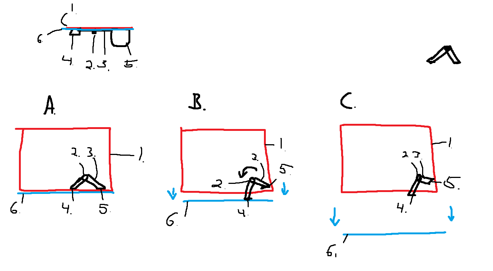

# Home improvements

## Drawer pedal

1. Static drawer frame
1. Pedal hinge
1. Pedal frame
1. Pedal drawer pusher
1. Pedal
1. Drawer face

#### State A

Starting state.
When the drawer is closed, the pedal will be in this state, drawer pusher is touching the drawer.
Drawer pusher and pedal are flush with the drawer face and the rest of the facade.

#### State B

Pedal is pushed in, causing the fra to rotate around the hinge. The frame then pushes the drawer out.

#### State C

The drawer is pulled out further than the reach of the frame, drawer pusher is no longer touching the drawer.

#### Reset

Resetting the hinge can be done by pusing the drawer in, going from state C to B to A.