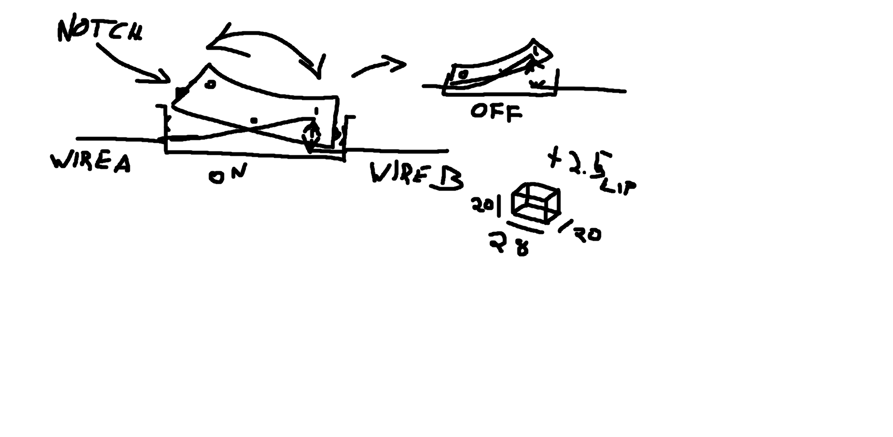

# Single Pole Single Throw (SPST) Switch

A home made switch for completeing a curcit.

**WARNING: this item may constitute a fire hazard. Use at your own risk!**

--- 

## Development

- Measurements given as [height]x[length]x[width]
- Arrow with a name ("-> [name]") indicate a parts or objects new name
- X, Y, and Z axes abbreviated to just "X", "Y", or "Z".

### General plan

A switch with a binary on/off state, flipping the lever will change the state, connecting or disconnecting the wires and completing or breaking a circuit.
There is no need to over-engineer this, all needed, in theory, is a housing, the lever itself, 2 wires, some glue, and a wire cutter or something sharp to fray the wires.
Bonus points for soldering to increase contact surfaces.
A cursory search did not yeld any information about standardized components or sizes, so there wasn't much thought put into it for development.

3 parts:
1. Part-A - Main housing
1. Part-B - the moving switch
1. Part-C (optional) - Clamps to keep wires in place

Rough plans drawn in paint:

### Version 0.0.1

#### Part-A

1. Created box, main housing, 20x20x28 mm -> A1
1. Created box, housing lip, 2x22x30 mm -> A2
1. Created negative space box, main housing space, 17x17x23.8 mm -> A-ns1
1. Aligned A1, A2, A-ns1 around X and Y, all top common Z
1. Combined -> A1
1. Created negative space cylinder, openings for wires, 40x2x2 mm -> A-ns2
1. Aligned A1, A-ns2 around X and Y, all bottom common Z
1. Moved A-ns2 +2 mm Z
1. Combine -> A1
1. Created negative space cylinder, slots for hinge where Part-B rotates around, 40x2x2 mm -> A-ns3
1. Created negative space box, slots where Part-B can lock position, 2x4x24.8 mm -> A-ns4
1. Aligned A1, A-ns3, A-ns4 around X and Y.
1. Moved A-ns3, A-ns4 +10 mm Z
1. Combine -> A1

#### Part-B

1. Created box, switch body, 10x23.8x17 mm -> B1
1. Created negative space half cylinder, arch on top of switch, 5x17x23.8 mm -> B-ns1
1. Created negative space box, angled faces on sides of switch, 20x20x20 -> B-ns2
1. Rotated B-ns2 -22.5 degrees around Y
1. Copied B-ns2 -> B-ns3
1. Rotated B-ns3 +90 degrees around X
1. Copied and combined (toggle negative space, combine) A-ns3, A-ns4 -> B2
1. Aligned all parts around X and Y, all bottom common Z
1. Aligned B1, B-ns1 to top shared Z
1. Moved B-ns2, B-ns3 +2 mm Z
1. Moved B-ns2 -18.5 mm X
1. Moved B-ns3 +18.5 mm X
1. Combine -> B1

#### Review

- Part-A
  - Can be overall smaller.
  - Add holes though floor for more wire options.
  - Thinner walls.
  - Should have a lip inside shaped as an upside-down V, so the switch cannot pivot too far down.
  - Pivot point could be slightly higher.
- Part-B
  - Part B should be smaller, 0.5 mm on Y parallel (short sides) so it does not rub against Part-A so much.
  - Curve could be slightly steeper, but the middle is flush with Part-A.
  - 1 and 0 on switch.
- B2
  - Combining A-ns3, A-ns4 was an error, A-ns3 should be used this way, but A-ns4 should be split and the notches rounded, then used on the sloped faces, rather than the vertical faces so Part-B can pivot and lock in place. For testing v0.0.1, these notches were simply cut off after print, before putting the parts together.

---

### Version 0.0.2

#### Part-A

1. Used Part-A v0.0.1 as base -> A1
1. Added a 1 mm thin wall 4 mm up from bottom on inside of housing
1. Removed lip around top for faster print
1. Removed bottom half for faster print

#### Part-B

1. Used Part-B v0.0.1 as base -> B1
1. Rotated B-ns2 and B-ns3 further, now a total of 30 degrees tilt
1. Moved B-ns2 and B-ns3 closer tot he part, now 15.5 mm from the collective X
1. Deleted A-ns4 from B2, not is just the hinge -> B2
1. Moved B2 +2 mm Z
1. Created two half cylinders, for notches to lock switch in position, 1x4x2 mm -> B3-1, B3-2
1. Rotated B3-1 +30 degrees around Z
1. Rotated B3-2 -30 degrees around Z
1. Moved B3-1 to middle of sloped face created by B1-ns2
1. Moved B3-2 to middle of sloped face created by B1-ns3
1. Combined all parts

#### Review

- Wall inside Part-A was not connected to the actual housing, slicer ignored this wall.
- It's a good idea to prototype with smaller segments before pringint the whole part, print of Part-A 0.0.2 was 60% faster than 0.0.1.

---

### Version 0.0.3

#### Part-A

1. Used Part-A v0.0.2 as base, removed inner walls -> A1
1. Changed size of A-ns1 to 13x26x18 mm
1. Changed size of A-ns3 to 2x2x19 mm
1. Moved hinge slots (A-ns3) to max common Z with A1, then -1 mm Z

#### Part-B

1. Created half cylinder, switch face, 10x26x18 mm -> B1
1. Created negative space box, switch face, 10x26x18 mm -> B1-ns1
1. Moved B1-ns1 +5 mm Z
1. Align center X Y Z
1. Combined -> B1
1. Copied B1 -> B2
1. Rotated B1 +180 degrees around Y
1. Moved B2 +5 mm Z
1. Created negative space box, B2 surplus material, 20x20x20 mm -> B2-ns1
1. Align center X Y Z
1. Combined B2, B2-ns1 -> B2
1. Copied A-ns3 from Part-A -> B3
1. Align center X Y Z
1. Moved B3 +3 mm
1. Created two half cylinder, latches, 1x2x4 mm -> B4, B5
1. Placed B4, B5 on B2
1. Rotated B4 +75 degrees around Y
1. Moved B4 -16 mm X
1. Made sure B4 sits 0.5 mm out of B2
1. Mirrored last three steps with B5
1. Combined -> B1

#### Review

- Part-A walls too thin and flexible, 2 mm should be fine, maybe lip and floor helps, but Part-A v0.0.2 is strong enough (3 mm walls) without them.
- Part-B fits better with rounded sides, slots for hinge and locking notches needs to be moved up, preferably the end of the active side should be close to flush with Part-A.

---

### Version 0.0.4

#### Part-A

1. Used Part-A v0.0.3 as base -> A1
1. Changed size of A-ns3 to 2x4x30 mm
1. Changed size of A-ns4 to 2x4x24.8 mm
1. Created a copy of A1 -> A2
1. Changed size of A2 to 2x22x30 mm
1. Aligned A1 and A2 with common top Z
1. Moved A2 -2 mm Z
1. Combined -> A1

#### Part-B

1. Used Part-B v0.0.3 as base -> B1
1. Moved B3 and B2-ns1 +2 mm Z
1. Combined -> B1

#### Review

- Part-A still weak even with brace, should have 3 mm thick walls.
- Part-B too large, shaving off 0.5 to 1 mm width-wise seems like it should be enough.
- Part-B should be more hollow to reduce material.
- Part-B should can have hollow "1" and "0" markings, making them extruding is difficult to print.
- Hinge and notches seem to be in a good position, does not seem to let anything though the off-side when on.

---

### Version 0.0.5

#### Part-A

1. Used Part-A v0.0.4 as base -> A1
1. Changed size of A-ns3 to 17x17x25 mm
1. Removed temporary unnamed brace
1. Combined -> A1

#### Part-B

1. Used Part-B v0.0.4 as base -> B1
1. Shrunk all parts but A-ns4 1.5 mm Y
1. Shrunk all parts but A-ns3 1 mm X
1. Combined -> B1

#### Review

- Part-A hinge holes are slightly too small due to printer support structure. For printing purposes, they should be slightly large than intended size, around 0.1 mm.
- Forgot numbers again
- The switch works as expected, but it's hard to tell if the notches on the sides enter the slots and exactly when they do.
- Width of Part-B could be reduced slightly more, less than 0.5 mm. Notches seem to scratch on wall of Part-A.
- Combining scratching with the missing event of a spring or mechanical even to push the switch away from a middle-position, the project seems somewhat pointless as it won't be as useful as even a temporary replacement for an actual switch.

### Version 0.0.6

#### Part-A

1. Used Part-A v0.0.5 as base -> A1
1. Changed size of A-ns2 to 40x2.2x2.2 mm
1. Combined -> A1

#### Part-B

1. Used Part-B v0.0.5 as base -> B1
1. Shrunk all parts but A-ns3 0.5 mm X
1. Added a "1" and "0" to the top
1. Combined -> B1

#### Review

- Part-A hinge still bulges around the hinge, but is not as bad.
- Shrinking Part-B lets some light though the activated side.
- Shrinking helped a lot with resistance on switch action.
- The activated side is slightly lower than the housing (creating a small indent, maybe 0.15 mm).
- Remaining resistance of switch action creates a pseudo "snap-to-action" effect which is very much wanted.
- Notch still align fine with slots.
- There's an obvious connection between the position of the hinge vs the path Part-B will take inside the housing of Part-A. I think I've accidentally stumbled upon a fairly decent setup despite planning to make a more conscious effort to align them at some later time whenever the relative sizes were in order (as they seem now).
- Next part will be restoring the lower part of Part-A which was removed to speed up the printing process. Then deal with the setup for completing the circuits by touching the wires when the switch is on.
- Seems one of the notches on Part-B doesn't align with the slot, realign all parts.

---

### Version 0.0.7

#### Part-A

1. Used Part-A v0.0.6 as base -> A1
1. Added bottom half again (from backup group)
1. Added a rectangle, a small snap-in clip to hold the wire coming in, 2x4x2 mm -> A-c1
1. Added a horizontal negative space cylinder, for the wire to sit in, 1x4x1 mm -> A-c1-ns1
1. Added a horizontal negative space cylinder, for the wire to slide into A-c1-ns1, 2x4x0.5 mm -> A-c1-ns2
1. Aligned A-c1, A-c1-ns1, and A-c1-ns2 along X Y Z
1. Moved A-c1-ns2 group to +1 mm Z
1. Combined A-c1, A-c1-ns1, and A-c1-ns2 -> A-c1
1. Aligned A1 and A-c1 along X and Y
1. Moved A-c1 +2 mm Z
1. Added a cylinder, the "anvil" which exposed wire will sit on top of, 6x6x4 mm -> A-n
1. Added a horizontal negative space cylinder, for exposed wire to wrap around the top of the anvil, 2x8x2 mm  -> A-n-ns
1. Aligned B-h and B-h-ns along X Y Z
1. Combined B-h and B-h-ns -> B-h
1. Rotated B-h +90 degrees Z
1. Rotated B-h +20 degrees Y
1. Added a negative half cylinder, as a temporary window to see inside action, 18x30x8 mm -> A-ns-w
1. Aligned A-ns-W with B1 X and Y
1. Moved A-ns-w +2 mm Z
1. Combined -> A1

#### Part-B

1. Used Part-B v0.0.6 as base -> B1
1. Re-aligned notch out of place
1. Changed size of B2-ns1 to 19x15x11 mm
1. Moved B2-ns1 to +2 mm Z (NB: absolute position)
1. Copied Part-As A-c1  -> B-c1
1. Aligned B1 and B-c1 along X and Y
1. Moved B-c1 +2 mm Z
1. Added a cylinder, the "hammer" which exposed wire will sit on top of, 4x4x4 mm -> B-h
1. Added a horizontal negative space cylinder, for exposed wire to wrap around the face of the hammer, 2x6x2 mm -> B-h-ns
1. Aligned B-h and B-h-ns along X Y Z
1. Combined B-h and B-h-ns -> B-h
1. Aligned B1 and B-h along X Y
1. Moved B-h +2 mm Z
1. Moved B-h -5 mm X
1. Combined -> B1

#### Review

- Remove similar window for Part-B as well.  
- 2 mm nice size for Arduino wires with insulation.
- 1 mm might be too small if stripped wires should double back into same hole as with the hammer and anvil, try Yx1x1.5.
- Remove wire clip on Part-A.
- Make wire clip hole larger, 2x1x1.5 mm hole for wire, 1 mm space for it to drop down though (for insulated, for stripped, current version should be a little large).
- Move anvil towards middle and raise it up (currently blocks Part-B from moving all the way, but stops it in just the right place to make the "1" side flush with Part-A lip).
- Make a groove for stripped wires to sit it, very small, do not want it to recede too far into the hammer or anvil.
- It was hard to get (insulate, while it should be a stripped one) wire though both hammer and anvil holes, window on side in Part-A made it much easier. Part-Bs hammer was possible without special window, using a pick or backside of small knife and a pair of pliers.
- Rotate hammer and nest +45 degrees Z (before tilting nest).
- Hammer and nest should be about 8 mm long each so they can touch.

---

### Version 0.0.8

#### Part-A

1. Used Part-A v0.0.7 as base -> A1
1. Deleted A-c1
1. Deleted A-n
1. Added a cylinder, the "anvil" which exposed wire will sit on top of, 6x6x8 mm -> A-n
1. Added a horizontal negative space cylinder, for exposed wire to wrap around the top of the anvil, 2x8x2 mm -> A-n-ns1
1. Added two negative space cylinder, to help align the wires coming out of A-n-ns1, 1x1x2 -> A-n-ns2, A-n-ns3
1. Aligned A-n, A-n-ns1, A-n-ns2, and A-n-ns3 around X and Y, top common Z
1. Moved A-n-ns2 -2.75 mm X
1. Moved A-n-ns3 +2.75 mm X
1. Combined A-n, A-n-ns1, A-n-ns2, and A-n-ns3 -> A-n
1. Aligned A1 and A-n X Y
1. Moved A-n +1 mm Z
1. Rotated A-n -45 degrees Z
1. Rotated A-n +10 degrees Y
1. Combined -> A1

#### Part-B

1. Used Part-B v0.0.7 as base -> B1
1. Moved B-c1 +4 mm X
1. Deleted B-h
1. Copied A-n -> B-h
1. Moved B-h -4 mm X
1. Rotated B-h -45 degrees Z
1. Combined -> B1

#### Review

- ...

---